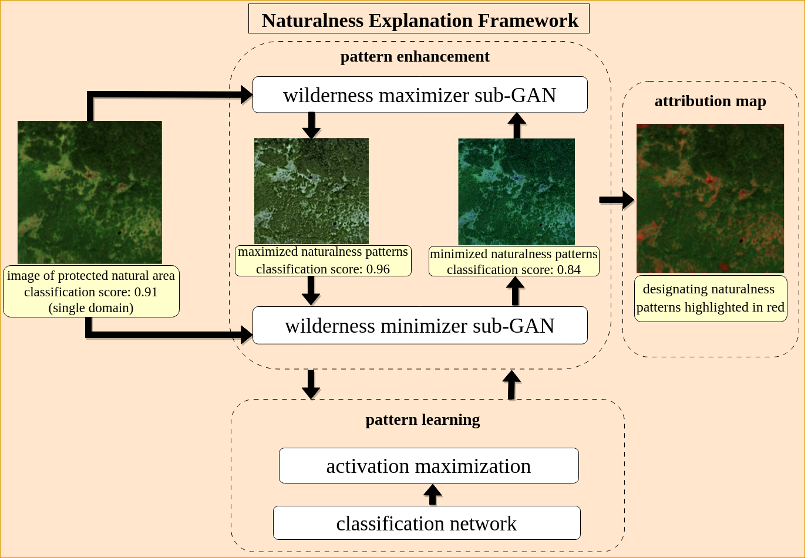
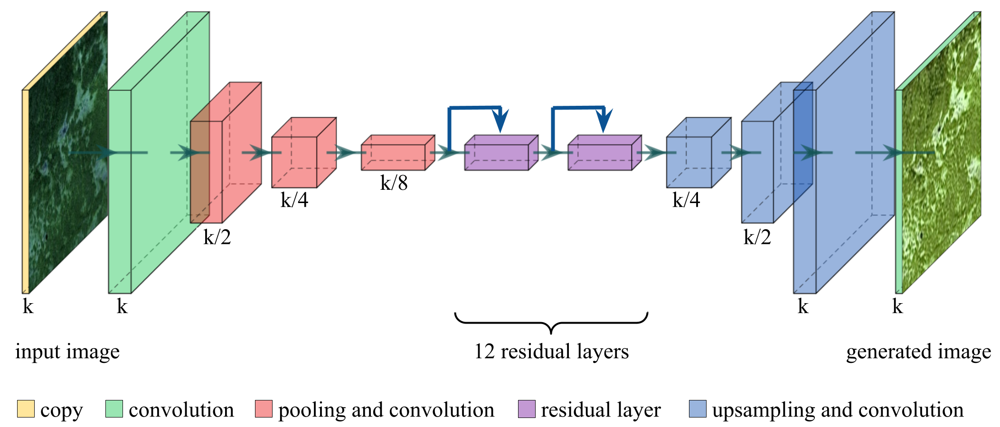
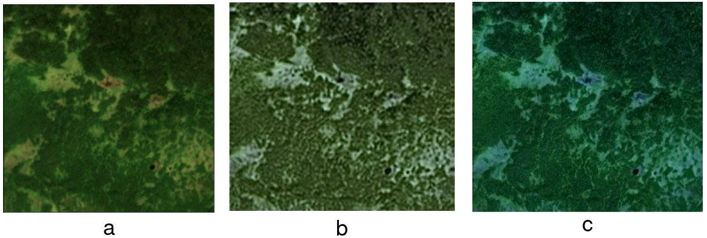

# Leveraging Activation Maximization and Generative Adversarial Training to Recognize and Explain Patterns in Natural Areas in Satellite Imagery

**Authors:** Ahmed Emam, Timo T. Stomberg, and Ribana Roscher

This repository provides the code for the research paper titled "Leveraging Activation Maximization and Generative Adversarial Training to Recognize and Explain Patterns in Natural Areas in Satellite Imagery". The work focuses on advancing the explanation of designating patterns that form protected and wild areas using a novel framework based on activation maximization and generative adversarial models.

## Abstract

Natural protected areas are vital for biodiversity, climate change mitigation, and supporting ecological processes. Despite their significance, comprehensive mapping is hindered by a lack of understanding of their characteristics and a missing land cover class definition. This paper aims to advance the explanation of the designating patterns forming protected and wild areas. To this end, we propose a novel framework that uses activation maximization and a generative adversarial model. With this, we aim to generate satellite images that, in combination with domain knowledge, are capable of offering complete and valid explanations for the spatial and spectral patterns that define the natural authenticity of these regions. Our proposed framework produces more precise attribution maps pinpointing the designating patterns forming the natural authenticity of protected areas. Our approach fosters our understanding of the ecological integrity of the protected natural areas and may contribute to future monitoring and preservation efforts.

**Keywords:** Explainable machine learning, Activation maximization, Generative models, Patterns discovery, Satellite Imagery, Protected Areas.

## Paper Summary

### Introduction
Natural areas with minimal human influence are crucial for biodiversity and understanding ecological processes. Satellite imagery, combined with machine learning (particularly CNNs), offers an effective way to monitor these areas. However, the decision-making processes of these models are often not interpretable. This work introduces a novel approach using activation maximization and CycleGAN-inspired architecture to generate complete and valid explanations for patterns defining natural areas, focusing on Fennoscandia.

### Proposed Approach

The proposed framework (illustrated in Figure 1) consists of three phases:

1.  **Pattern Learning:** A single-class classifier is trained to learn the characteristic patterns of the class of interest (e.g., natural protected areas).
2.  **Pattern Enhancement:** A modified CycleGAN architecture is used. It has two sub-GANs: a pattern-maximizer and a pattern-minimizer. These generators produce images that maximize or minimize the classifier's score from the pattern learning phase, respectively, by incorporating an activation maximization loss term. The generator architecture is shown in Figure 2.
3.  **Attribution Mapping:** The average absolute difference between the pattern-maximized and pattern-minimized images is calculated for each band to produce attribution maps, highlighting class-discriminative patterns.

**Figure 1: Flowchart of the proposed approach**


*Caption from paper: Flowchart of the proposed approach: (left part) The input image displays the class of interest, and it has a classification score of 0.91 from the classification network. (top middle part) pattern enhancement: Cycle GAN consists of the patternmaximizer sub-GAN that generates an image with enhanced patterns of the specific class and the pattern-minimizer sub-GAN that generates an image of the same size but with suppressed characteristics. The synthesized images have classification scores of 0.96 and 0.84, respectively. (bottom middle part) pattern learning: trained classifier for the class of interest being fed with the generated images from b, giving feedback to both generators in the Cycle GAN [10] to maximize and minimize the characteristics in both sub-GANs, respectively; (right part) attribution mapping: showing the contribution of each pixel to the class of interest...*

**Figure 2: Generator’s architecture**


*Caption from paper: Generator’s architecture used in both sub-GANs in the pattern enhancement phase.*

### Experiments, Results, and Discussions

The approach was tested on the AnthroProtect dataset, focusing on protected natural areas in Fennoscandia using Sentinel-2 imagery (RGB bands). The modified CycleGAN uses PatchGAN discriminators.

**Figure 3: Generated outputs from the sub-GANs**


*Caption from paper: Generated outputs from the sub-GANs. (a) Original image. (b) the output of the pattern maximizer sub-GAN. (c)the output of the pattern minimizer sub-GAN.*

The results (Figures 3, 4, and 5) demonstrate that the pattern-maximizer enhances features like brighter wetlands, while the pattern-minimizer highlights borders of wetlands and water bodies. The attribution maps generated by this method show higher importance to wetlands and small water bodies, aligning better with domain knowledge and expert opinions compared to other methods like DeepLIFT, Occlusion Sensitivity Maps (OSM), and GradCAM.

**Table I: Average Intersection over Union (IoU) for pixels with high attributions with wetlands and bare lands classes.**

| Method    | DeepLIFT | OSM  | GradCAM | Ours | 
| :-------- | :------- | :--- | :------ | :--- |
| IoU %     | 81.2     | 69.1 | 53.3    | 93.2 |

**Figure 4: Comparison of attribution maps**


*Caption from paper: Comparison of attribution maps from different explainable machine learning methods. (a) a segmentation mask showing the wetlands pattern in yellow, green representing heavy vegetation, (b) attribution map from DeepLIFT, (c) occlusion sensitivity map, (d) GradCAM, and (e) attribution map from our proposed method...*

**Figure 5: Original input images and corresponding attribution maps**


*Caption from paper: (Top row) shows original input images. (Bottom row) shows the corresponding attribution maps produced by our approach.*

*(Note: Additional extracted image elements `fig-005.png` to `fig-008.png` are available in the `readme_figures` directory but are not explicitly referenced as main figures in the paper text.)*

### Conclusion

We proposed a novel, explainable machine learning approach to suppress and enhance image patterns and produce attribution maps incorporated with domain knowledge to produce valid and complete explanations. We utilize the concept of activation maximization and integrate it into a Cycle Consistent Generative Adversarial Network’s objective function to maximize the characterizing patterns of a specific class. We utilized our approach to analyze patterns in satellite imagery to better understand natural protected areas. We could show that our approach is more suitable to explain the patterns corresponding to the naturalness integrity of the protected natural areas in Fennoscandia. Our proposed method can produce complete, valid explanations of the designating geo-ecological patterns that uphold the ecological authenticity of the protected areas more than other methods. Since our approach can be extended to multi-class classifications and various applications, we consider it a promising direction in the Earth sciences.

## Repository Overview

This repository contains the Python code to implement and train the CycleGAN-based model described in the paper for generating explainable attribution maps. The code has been cleaned and commented for better understanding and usability by researchers.

Key components:

*   `cyclegan.py`: Main script for training the CycleGAN model, including data loading, model initialization, training loop, and image sampling. (This appears to be the primary script from the original repository structure). Note: This script uses a specific setup for `mapinwild` or `anthroprotect` datasets.
*   `generator.py`, `patch_discriminator.py`: Define the Generator (ResNet-based) and Discriminator (PatchGAN) architectures.
*   `*.py` (e.g., `adversarial_loss.py`, `cycle_loss.py`, `identity_loss.py`): Implement various loss components used in training.
*   Building blocks (e.g., `contracting_block.py`, `expanding_block.py`, `residual_block.py`): Define modular parts of the networks.
*   `dataset.py`: Utility for loading image datasets.
*   `ttorch_datamodule.py`, `models/asos.py`: Modules related to data handling and classifier models used in the paper's experiments (e.g., for AnthroProtect/MapInWild datasets).

## Setup and Usage

1.  **Clone the repository:**
    ```bash
    git clone https://github.com/ahmedemam576/SpacEX.git
    cd SpacEX
    ```

2.  **Create a Python Environment:**
    It is recommended to use a virtual environment (e.g., conda or venv).
    ```bash
    # Example with conda
    conda create -n spacex_env python=3.9
    conda activate spacex_env
    ```

3.  **Install Dependencies:**
    The core dependencies include PyTorch, torchvision, and other common scientific libraries. You may need to install them manually. A `requirements.txt` file is recommended for future use.
    Key dependencies (install via pip or conda):
    *   `torch`
    *   `torchvision`
    *   `torchaudio`
    *   `numpy`
    *   `Pillow` (PIL)
    *   `tqdm`
    *   `pandas` (for data handling as seen in `cyclegan.py`)
    *   `matplotlib` (for visualization, if any)

    The original `cyclegan.py` script also implies usage of a custom library `tlib` (`from tlib import tlearn, ttorch, tutils`) and specific model paths (e.g., `./models/asos_mapinwild_rgb-channels_cutmix.pt`). These would need to be available or adapted for your use case.

4.  **Prepare Data:**
    The script `cyclegan.py` is set up to use datasets like 'horse2zebra', 'anthroprotect', or 'mapinwild'. You will need to download and structure your data accordingly or modify the data loading parts of the script.
    For the 'mapinwild' or 'anthroprotect' experiments, the script expects data at a path like `/data/home/aemam/datasets/mapinwild` and a CSV file for tile information.

5.  **Run Training:**
    The main training script appears to be `cyclegan.py`. It takes several command-line arguments.
    ```bash
    python cyclegan.py --dataset_name your_dataset_name --n_epochs 200 --batch_size 1 --lr 0.0002 ... (other arguments)
    ```
    Refer to the `argparse` section in `cyclegan.py` for all available training options.

## Citation

If you use this work or code, please cite the original paper:

```bibtex
@ARTICLE{10325539,
  author={Emam, Ahmed and Stomberg, Timo T. and Roscher, Ribana},
  journal={IEEE Geoscience and Remote Sensing Letters},
  title={Leveraging Activation Maximization and Generative Adversarial Training to Recognize and Explain Patterns in Natural Areas in Satellite Imagery},
  year={2024},
  volume={21},
  number={},
  pages={1-5},
  keywords={Adversarial machine learning;Climate change;Biodiversity;Satellite images;Biological system modeling;Climate change;Protected areas;Activation maximization;explainable machine learning;generative models;patterns discovery},
  doi={10.1109/LGRS.2023.3335473}
}
```

## Acknowledgments

The paper acknowledges funding from DFG projects RO 4839/5-1, SCHM 3322/4-1, and RO 4839/6-1, as well as support from DFG’s Excellence Strategy, EXC-2070 - 390732324 PhenoRob.

